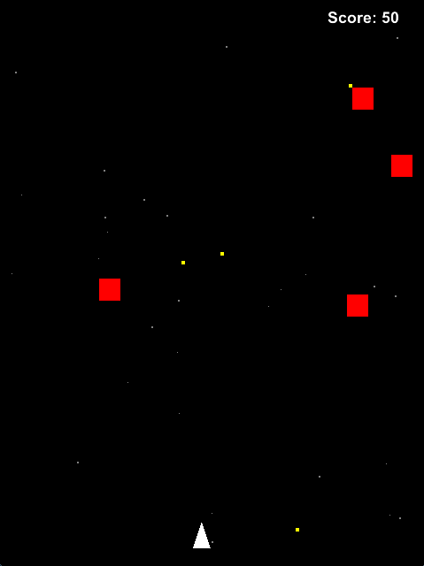

spaceship
=========

Very simple arcade game built with Gosu (Ruby).



Built with
----------

* Ruby
* [gosu](http://www.libgosu.org/)
* [hasu](https://github.com/michaelfairley/hasu)


How to run this game
--------------------

```
git clone https://github.com/mrhead/spaceship
cd spaceship
bundle install
ruby game.rb
```

Controls
--------

* R/r - restart game
* left/right arrow - move ship
* space - fire!
* left mouse button - fire!
* mouse - move ship

Comments
--------

This is my only not tested Ruby code and I am not proud of it. When I started writing this game I had no idea how to do it and test it.

However now, after some refactoring I can see some code which could (and should) be tested. If I am going to write any other game, then I am going follow TDD. At least for testable objects.
